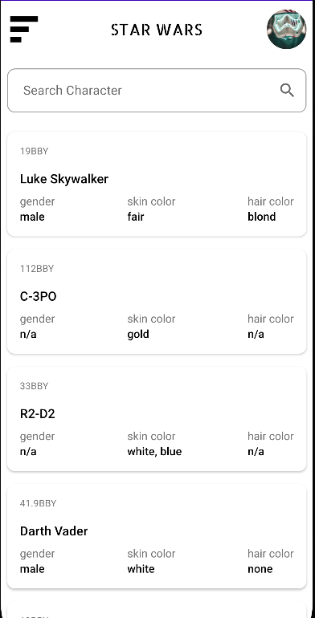
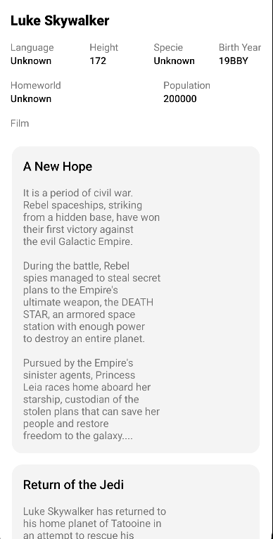
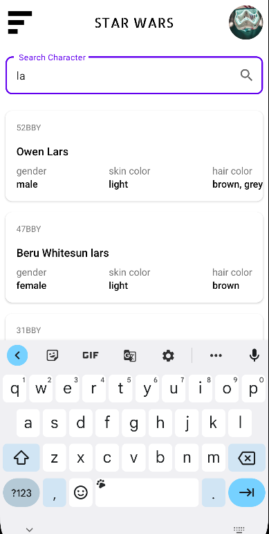

# Star Wars
Application that displays the character name in the star wars movie

## Environment
To run the application successfully you'll require
- Android Studio
- Kotlin

## Architecture
This project was implemented using clean architecture with the MVVM (Model View Model ) pattern. Thus the project is divided in 3 parts 
- Domain
- Data 
- App

#### Domain
This is an abstraction layer containing definitions of business logic. Major made of plain Kotlin modules. It defines use cases, domain and repository interfaces.

#### Data
This is the data layer of the application consisting of network models, mappers and repository implementation.

#### App
This layers is the implementation of the inner layers. It majorly contains User Interface Widget controllers like view models, fragments, activities and adapters

## Libraries
For the successful completion of the application I used the various libraries
- Android Jetpack
    * Data binding
    * Live Data 
    * Navigation
- Retrofit
- Glide
- Kotlin coroutines
- Material Design
- OkHttp interceptor

## App Design
.

